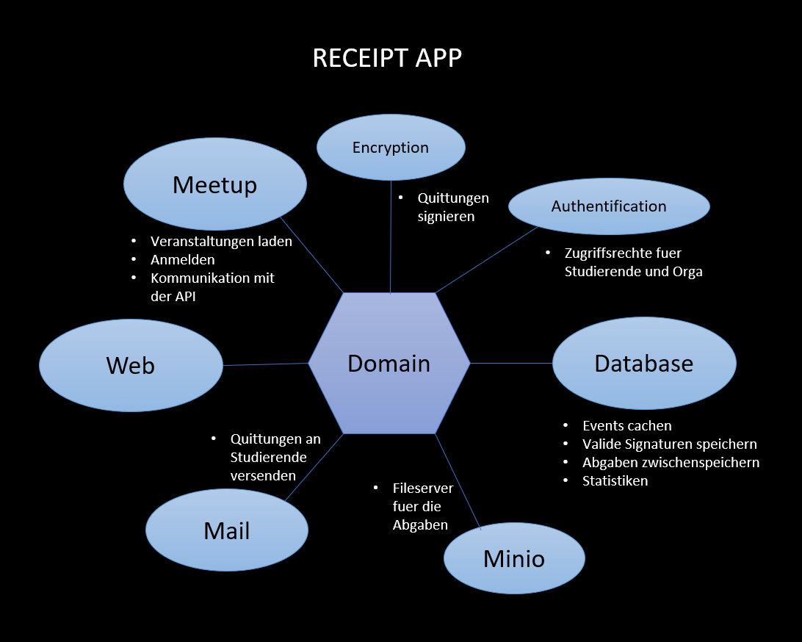
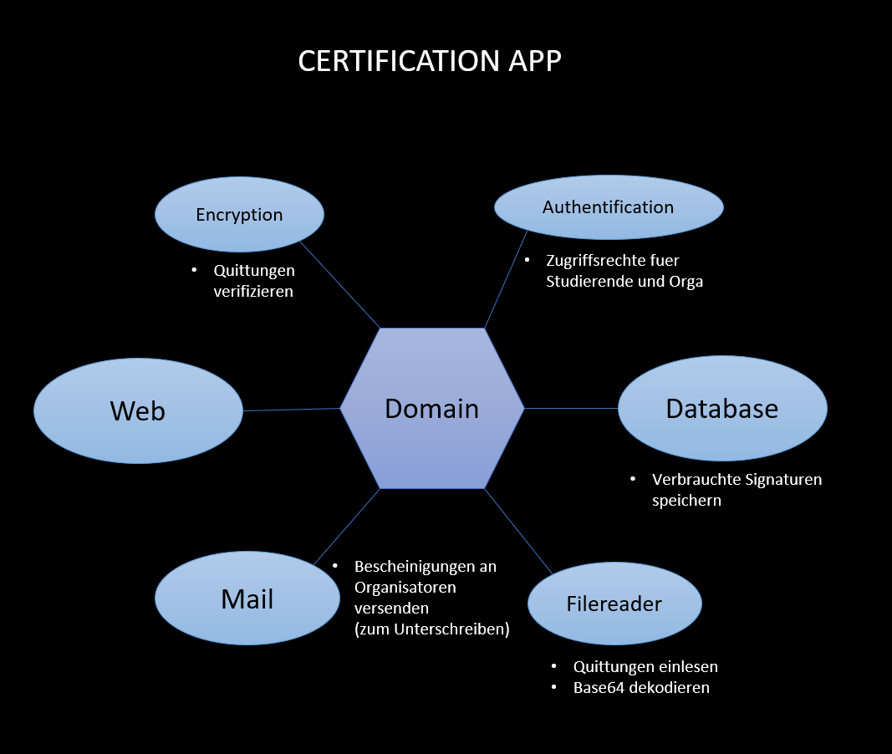

[[section-building-block-view]]
== Bausteinsicht

=== Receipt App

****
|===
| **Name** | **Verantwortung**
| _MeetupClient_ | _Schnittstelle zur Meetup API_
| _MeetupService_ | _Schnittstelle um Informationen zu der Veranstaltungen zu bekommen_
| _MinIO Services_ | _Schnittstelle zu MinIO_
| _Encryption Service_ | _Aus den Informationen der Abgaben werden Hashvalues generiert für die kryptographischen Quittungen_
| _ChartService_ | _Schnittstelle zur view chart_data_
| _ReceiptServices_ | _Verwaltung der Quittungen_
| _SubmissionAccessService_ | _Verwaltung der Abgaben_
|===
****

==== MeetupClient
****
- Es wird ein Get Request an die MeetupAPI-URL geschickt und wenn eine Antwort geschickt wurde, werden DTO's mittels des Spring RestTemplates befüllt und es wird direkt gefiltert, welche Informationen benötigt werden.
****

==== MeetupService
****
- In periodischen Abständen werden Veranstaltungsinformationen über die Schnittstelle zur Meetup API angefragt und über die Schnittstelle zur Datenbank dort eingefügt.
- Mehrere Funktionen für Filterug der Veranstaltungen
****

==== MinIO Services

****
- Der MinIoDownloadService kümmert sich um den download der Abgaben aus MinIO
- Der MinIoUploadService kümmert sich um den upload der Abgaben und speichern in MinIO.
****

==== Encryption Services

****
- EncryptionService erstellt Hashes aus den Abgaben
- KeyService kümmert sich um vergleichen der Hashes
****

==== ChartService

****
- Relevante statistische Informationen werden geladen und in ein Objekt zum Anzeigen im Frotend gepackt.
****

==== ReceiptService

****
- Quittungen werden hier erstellt, per E-mail gesendet sowie auch eingelesen.
****

==== SubmissionAcessService

****
- Abgaben können hier vom Organisator akzeptiert werden, und für Studenten im Frontend angezeigt werden.
****

=== Certification App

|===
| **Name** | **Verantwortung**
| _Encryption_ | _Kryptographiesche hashes entschlüsseln_
| _Mail_ | _Schnittstelle für das senden von E-mails_
| _Filereader_ | _Schnittstelle zu MinIO_

|===

== Encryption:

****
- Abgegebene Quittungen werden verifiziert
- Keine Quittung zweimal abgeben
- Bekommt Signatur aus der anderen Application
****

== Mail:

****
- Bei korrekter Abgabe wird die Bestätigungsmail darüber geschickt.
****

== Filereader:

****
Weiss ich nicht was da gemacht wird
****

